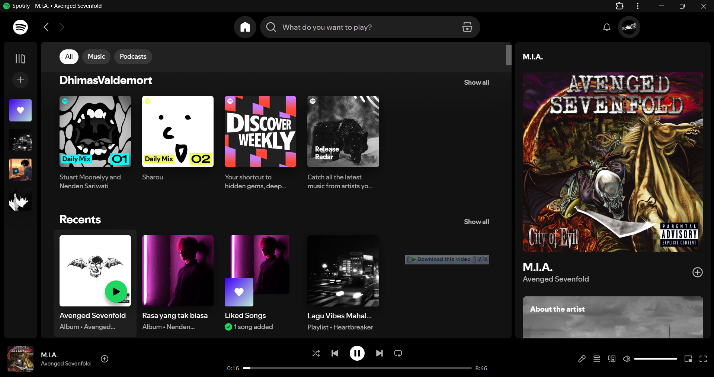

# Spotify Mod Chrome Plugin

> **Update**: Now fully compatible with Chrome **Manifest V3**! 🚀
> 
> What's new: Removed all audio ads, blocked tracker domains, and removed the premium upgrade button 🎉

## Features
- **Blocks Audio Ads**: Utilizes Chrome's `declarativeNetRequest` API to silently block ad servers at the network level.
- **Cleans UI**: Injects CSS to hide annoying "Upgrade to Premium" banners and buttons.
- **Fast & Lightweight**: Works purely via network rules and basic CSS manipulation without heavy scripts.

## How to install

1. Clone or download this repo into a folder.
2. Go to `chrome://extensions` in your browser.
3. Make sure **Developer mode** (in the upper right corner) is **ON**.
4. Click **Load unpacked** and select the folder containing this repo (or drag & drop the folder).
5. Open [Spotify Web](https://open.spotify.com).

